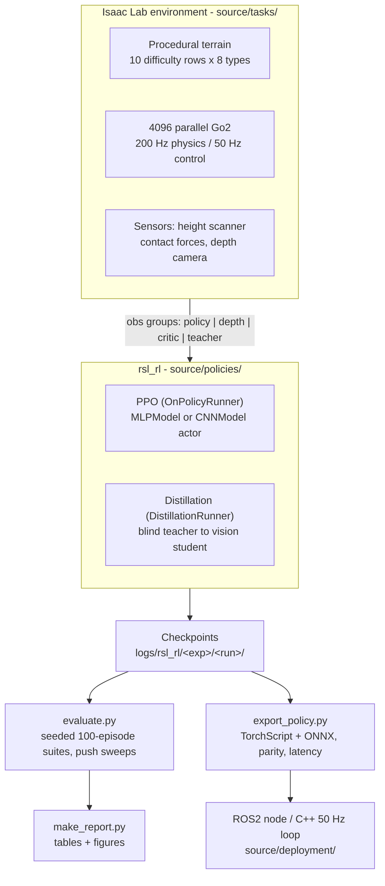
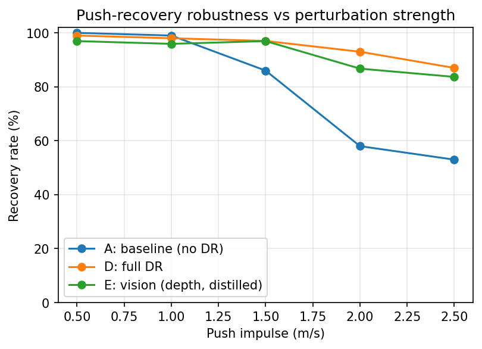
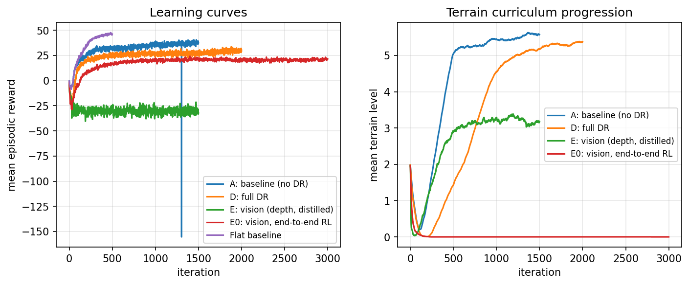

# Sim-to-Real Reinforcement Learning for Robust Quadruped Locomotion

PPO-trained locomotion policies for a Unitree Go2 in NVIDIA Isaac Lab, covering a blind
flat-ground baseline, rough-terrain traversal with a difficulty curriculum, full domain
randomization, and a depth-camera policy obtained by distillation. Includes a seeded
evaluation harness, reward-term ablations, and a TorchScript/ONNX deployment path with
measured inference latency.

**Stack:** Isaac Sim 5.1, Isaac Lab 0.54.4, rsl-rl-lib 5.0.1, PyTorch 2.7.0+cu128.
**Hardware used:** one NVIDIA RTX 5070 (12 GB), Windows 11.

## Summary of findings

1. Domain randomization reverses the policy ranking under perturbation. The
   non-randomized baseline is the better policy in clean simulation and the worse one
   under a push, degrading from 100% to 53% recovery as the impulse grows to 2.5 m/s,
   while the randomized policy holds 87%.
2. Training method mattered more than sensor quality. A policy using only a forward
   depth camera recovers 83.7% of pushes at 2.5 m/s, against 53.0% for a baseline that
   receives a privileged height map of the ground on all sides.
3. End-to-end PPO from pixels did not work. It converged to a stand-and-turn policy that
   scores well on survival and travels 1.57 m per 20-second episode. Teacher-student
   distillation from the blind randomized policy fixed it, reaching 14.53 m.
4. The terrain curriculum is a precondition, not a refinement. Removing it while holding
   terrain exposure constant takes success from 100% to 0%.
5. Success rate alone is misleading. The failed vision policy outscores the working one
   on success rate (92% vs 90%) while travelling roughly a tenth as far.

## System



Physics runs at 200 Hz and the policy at 50 Hz. Actions are 12 joint position offsets
around the default stance, scaled by 0.25 rad and tracked by a PD controller, which
matches the interface the hardware exposes and bounds what early exploration can command.

## Task ladder

| Task | Terrain | Actor observes | Randomization |
|---|---|---|---|
| `Go2-Flat-v0` | plane | proprioception (48) | mild |
| `Go2-Rough-v0` | procedural grid + curriculum | proprioception + height scan (235) | mild |
| `Go2-Rough-DR-v0` | procedural grid + curriculum | proprioception + height scan (235) | full, including latency |
| `Go2-Vision-v0` | procedural grid + curriculum | proprioception (48) + 64x64 depth | full |
| `Go2-Vision-Distill-v0` | procedural grid + curriculum | proprioception (48) + 64x64 depth | full, distilled from `Go2-Rough-DR-v0` |

## Results

Evaluation is seeded (`evaluate.py --seed 42`). Every policy sees an identical sequence of
spawn poses, velocity commands, and physics-material draws, so a difference between rows
is attributable to the policy rather than to sampling. Re-running one checkpoint through
an unseeded harness moved its success rate by 2 points, which is why the seed is fixed.

Metric definitions: `success` means the episode reached timeout without a trunk collision.
`CoT` is cost of transport, `E / (m g d)`, dimensionless and comparable across robots.

### Nominal suite, 100 episodes per policy

| Policy | Actor observes | Success % | Distance (m) | Vel err (m/s) | Energy/m (J/m) | CoT |
|---|---|---|---|---|---|---|
| A: baseline (no DR) | proprioception + height map | 100.0 | 16.80 | 0.112 | 55.74 | 0.378 |
| D: full DR | proprioception + height map | 99.0 | 15.33 | 0.151 | 55.72 | 0.378 |
| E: vision, distilled | proprioception + depth camera | 90.0 | 14.53 | 0.210 | 71.54 | 0.486 |
| E0: vision, end-to-end RL | proprioception + depth camera | 92.0 | 1.57 | 0.594 | 166.21 | 1.128 |

Policy A is the strongest policy here, which is the expected result and not the point. See
the robustness sweep below.

Row E0 is the failed end-to-end vision run, retained for comparison. Its success rate
exceeds that of the working vision policy while it travels 1.57 m per episode against
14.53 m. Ranking these two policies by success rate inverts the correct ordering, which is
the clearest argument in this project for reporting a metric suite rather than one number.

### Push-recovery robustness

Recovery rate after a lateral velocity impulse applied mid-episode, scored over a 3 s
window, 100 episodes per point.

| Push (m/s) | A: baseline | D: full DR | E: vision, distilled |
|---|---|---|---|
| 0.5 | 100.0 | 99.0 | 96.9 |
| 1.0 | 99.0 | 98.0 | 95.9 |
| 1.5 | 86.0 | 97.0 | 96.9 |
| 2.0 | 58.0 | 93.0 | 86.7 |
| 2.5 | 53.0 | 87.0 | 83.7 |



The curves separate between 1.0 and 1.5 m/s, which is approximately where the
perturbation leaves the distribution policy A was trained on. At 2.5 m/s the randomized
policy leads the baseline by 34 points.

The distilled vision policy is statistically tied with its teacher at 1.5 m/s and trails
by 3.3 points at 2.5 m/s, despite having no access to the height map. This suggests that
most of what the teacher learned about surviving an impulse is carried by the
proprioceptive pathway rather than by exteroception, which is a favourable result for
deployment because proprioception is the more reliable sensing on hardware.

### Terrain curriculum



| Policy | Final mean terrain level (of 9) |
|---|---|
| A: baseline | 5.58 |
| D: full DR | 5.38 |
| E: vision, distilled | 3.18 |
| E0: vision, end-to-end RL | 0.00 |

The plateau near 5.5 for the blind policies is an equilibrium rather than a ceiling. The
curriculum promotes on more than 4 m travelled and demotes on failure, so it settles where
promotion and demotion balance, which is a measure of the policy's competence at this
training budget.

### Reward-term ablations

One full retrain per row, same seed, same 1500-iteration budget, same evaluation protocol.
`foot slip`, `action rate`, and `torque` were added to the harness for this experiment,
because zeroing a reward weight makes that term log as 0.0 during training and the reward
telemetry therefore cannot show whether the suppressed behaviour returned.

| Removed | Success % | Distance (m) | Foot slip (m/s) | Action rate | Torque (N·m) | CoT |
|---|---|---|---|---|---|---|
| *(none: full reward)* | 100.0 | 16.80 | 0.046 | 0.884 | 2.87 | 0.378 |
| `feet_slide` | 98.0 | 16.74 | 0.124 | 0.850 | 2.92 | 0.375 |
| `action_rate` + `action_smoothness` | 97.0 | 16.17 | 0.067 | 1.051 | 3.01 | 0.439 |
| `energy` + `joint_torques` | 97.0 | 17.78 | 0.077 | 1.007 | 3.11 | 0.420 |
| terrain curriculum | 0.0 | 0.84 | 0.685 | 1.994 | 3.81 | 0.496 |

Success rates of 97 to 100% fall inside evaluation noise and should not be read as a
trend. The results that do carry signal:

- **Terrain curriculum.** Success 100.0% to 0.0%, distance 16.80 m to 0.84 m. The override
  also spreads the initial terrain level across all 10 rows, so both conditions see the
  same terrain distribution and only the ordering differs. Progressive difficulty is
  therefore load-bearing rather than a refinement.
- **Effort penalties.** Removing `energy` and `joint_torques` made the policy better at the
  task, travelling further with lower velocity error, at the cost of 8% more torque and
  11% worse cost of transport. This is the intended behaviour of an effort penalty rather
  than a failure, and the weight sets the exchange rate.
- **Foot-slip penalty.** Foot slip rose 2.7x with every headline metric unchanged. The term
  buys gait quality rather than task performance, which matters for transfer because
  skating abrades real feet and corrupts leg odometry.
- **Smoothness penalties.** Action rate rose 19%, less than the hypothesis suggested, but
  cost of transport rose 16% and tracking degraded. These terms appear to earn their place
  through efficiency rather than by suppressing visible jitter.

## Deployment

Exported with rsl-rl's own JIT and ONNX exporters, which script a deterministic-inference
copy of the model, so parity with the eager model is exact rather than approximate.
Benchmarked at batch size 1 over 500 iterations after warm-up.

| Metric | Blind DR policy | Vision student |
|---|---|---|
| Export vs eager, max abs error | 0.00e+00 | 0.00e+00 |
| TorchScript CPU p50 (ms) | 0.096 | 0.597 |
| TorchScript CPU p95 (ms) | 0.105 | 0.753 |
| TorchScript CPU p99 (ms) | 0.110 | 1.045 |
| TorchScript CUDA p95 (ms) | 0.633 | 1.535 |

At 50 Hz the control loop has a 20 ms budget. Blind inference consumes 0.5% of it and the
vision student 3.8%, so policy inference is not the bottleneck; sensor acquisition and the
depth render dominate on hardware.

CPU is roughly 6x faster than CUDA at batch size 1. For a network of this size,
kernel-launch and host-to-device transfer overhead exceed the arithmetic, so the GPU only
wins in the batched training regime. The practical conclusion is to run the deployed policy
on the robot's CPU and leave the GPU for perception.

`source/deployment/` contains a ROS2 inference node and a C++ libtorch control loop. Both
reproduce the training observation layout exactly, including re-indexing incoming joint
states by name, and add EMA action filtering, soft-limit clamping, command and state
watchdogs, and deadline-miss accounting. Robot I/O in the C++ loop is stubbed behind two
functions marked for vendor SDK calls.

## Reproduce

Requires Isaac Sim and Isaac Lab installed per the official guide, plus an NVIDIA GPU.
`rsl-rl-lib` ships with Isaac Lab. Run all commands from the repository root through Isaac
Lab's Python environment (`isaaclab.bat -p` on Windows, `./isaaclab.sh -p` on Linux).

```bash
# Flat baseline, a sanity gate before rough terrain
python source/policies/train.py --task Go2-Flat-v0 \
    --agent_cfg configs/ppo_baseline.yaml --env_cfg configs/env_flat.yaml \
    --experiment_name go2_flat --headless --num_envs 2048 --max_iterations 500 --seed 42

# Policy A: rough terrain with curriculum
python source/policies/train.py --task Go2-Rough-v0 \
    --agent_cfg configs/ppo_baseline.yaml --env_cfg configs/env_rough.yaml \
    --headless --num_envs 4096 --max_iterations 1500 --seed 42

# Policy D: full domain randomization
python source/policies/train.py --task Go2-Rough-DR-v0 \
    --agent_cfg configs/ppo_domain_randomized.yaml \
    --headless --num_envs 4096 --max_iterations 2000 --seed 42

# Policy E0: end-to-end PPO from pixels. Reproduces the documented failure.
python source/policies/train.py --task Go2-Vision-v0 \
    --agent_cfg configs/ppo_vision.yaml \
    --headless --enable_cameras --num_envs 512 --max_iterations 3000 --seed 42

# Policy E: distilled from the blind DR teacher
python source/policies/train.py --task Go2-Vision-Distill-v0 \
    --agent_cfg configs/distill_vision.yaml \
    --teacher_checkpoint logs/rsl_rl/go2_rough_dr/<run>/model_1999.pt \
    --headless --enable_cameras --num_envs 512 --max_iterations 1500 --seed 42

# Evaluation: nominal suite and one push point
python source/policies/evaluate.py --task Go2-Rough-Play-v0 \
    --agent_cfg configs/ppo_domain_randomized.yaml \
    --num_episodes 100 --num_envs 128 --seed 42 --headless
python source/policies/evaluate.py --task Go2-Rough-Play-v0 \
    --agent_cfg configs/ppo_domain_randomized.yaml --suite push --push_speed 2.5 \
    --num_episodes 100 --num_envs 128 --seed 42 --headless

# Reward ablation: one line of config, no code change
python source/policies/train.py --task Go2-Rough-v0 \
    --agent_cfg configs/ppo_baseline.yaml \
    --env_cfg configs/env_rough_ablate_feet_slide.yaml \
    --experiment_name go2_ablate_feet_slide \
    --headless --num_envs 4096 --max_iterations 1500 --seed 42

# Export, parity check, and latency benchmark
python source/policies/export_policy.py --task Go2-Rough-Play-v0 \
    --agent_cfg configs/ppo_domain_randomized.yaml --onnx --headless

# Inspect terrain or watch a policy in the viewport
python source/policies/play.py --task Go2-Rough-Play-v0 --policy zero --num_envs 32

# Regenerate every table and figure from the raw evaluation JSONs
python source/policies/make_report.py
```

On a 12 GB card the blind tasks fit at 4096 environments (6.9 GB) and the vision tasks at
512 (9.4 GB). Approximate wall clock on an RTX 5070: 16 min flat, 2.3 h rough, 3.3 h DR,
6.6 h end-to-end vision, 3.4 h distillation.

## Design decisions

- **PPO rather than SAC.** On-policy learning with massive parallelism outperforms
  replay-buffer sample efficiency when samples are nearly free, and PPO is more stable
  under the non-stationarity a terrain curriculum introduces.
- **Position targets with an underlying PD controller rather than torques.** The PD loop
  provides local feedback at full physics rate between policy steps, the 0.25 rad action
  scale bounds what exploration can command, and it matches the hardware interface.
- **Depth rather than RGB.** Depth is a direct geometric measurement, so there is no
  appearance or lighting domain gap to randomize away, and foot placement needs geometry
  rather than texture.
- **Asymmetric actor-critic.** The critic is discarded after training, so it reads clean
  privileged state including foot contacts and the true height map, while the deployed
  actor sees only realistic sensing.
- **Latency randomization.** 0 to 20 ms actuator delay and 0 to 40 ms observation delay,
  sampled per environment. This is the randomization axis most simulation-only work omits
  and a leading cause of real-world failure.
- **Distillation for the vision policy.** Learning locomotion and terrain perception
  simultaneously under full randomization is an exploration problem, and PPO solved it by
  standing still. A privileged teacher supplies the correct action at every visited state,
  leaving the student only the perception problem.
- **Image as a separate observation group.** rsl-rl dispatches observation groups by tensor
  rank, so a rank-4 group is routed to a CNN encoder. Flattening the image into the policy
  vector would discard the spatial structure the convolutions exist to exploit.

## Repository layout

```
configs/            PPO and distillation agent YAMLs, env override YAMLs.
                    Reward ablations are one line here, not a code change.
source/tasks/       Isaac Lab environments: rewards, observations,
                    terrain curriculum, domain-randomization events
source/policies/    train / evaluate / export / play / make_report
source/deployment/  ROS2 inference node, C++ libtorch 50 Hz loop
reports/            final_report.md, ablation_tables.md, generated tables
media/              figures referenced above
```

## Reports

- [`reports/final_report.md`](reports/final_report.md): full results, the robustness
  experiment, deployment measurements, and a failure analysis covering a reward term
  measured in the wrong reference frame, a survivorship bias in episode sampling, and the
  end-to-end vision collapse.
- [`reports/ablation_tables.md`](reports/ablation_tables.md): ablation results and the
  reasoning behind each experiment's design.

## Known limitations

- Single seed per condition. All comparisons are n=1. Push recovery is an
  out-of-distribution metric that nobody optimizes directly, and one baseline retrain
  moved its 2.5 m/s recovery rate by 26 points despite near-identical nominal metrics. A
  three-seed sweep with error bars is the obvious next experiment.
- No hardware results. The transfer argument rests on robustness under perturbation and
  latency randomization in simulation, which is a proxy.
- Ablations cover 7 of 18 reward terms, and the two grouped rows do not separate the
  members of each pair.
- The vision policy is single-frame with no memory, so terrain that leaves the field of
  view is forgotten. A recurrent student is the natural extension.
- A distilled student cannot exceed its teacher, and the teacher itself plateaued at
  terrain level 5.38. DAgger-style iterative distillation would let the student improve on
  states its own policy visits.

## References

- Rudin et al., 2022. *Learning to Walk in Minutes Using Massively Parallel Deep RL.*
- Lee et al., 2020. *Learning Quadrupedal Locomotion over Challenging Terrain.*
- Agarwal et al., 2022. *Legged Locomotion in Challenging Terrains using Egocentric Vision.*
- NVIDIA Isaac Lab; ETH Zurich rsl_rl.
